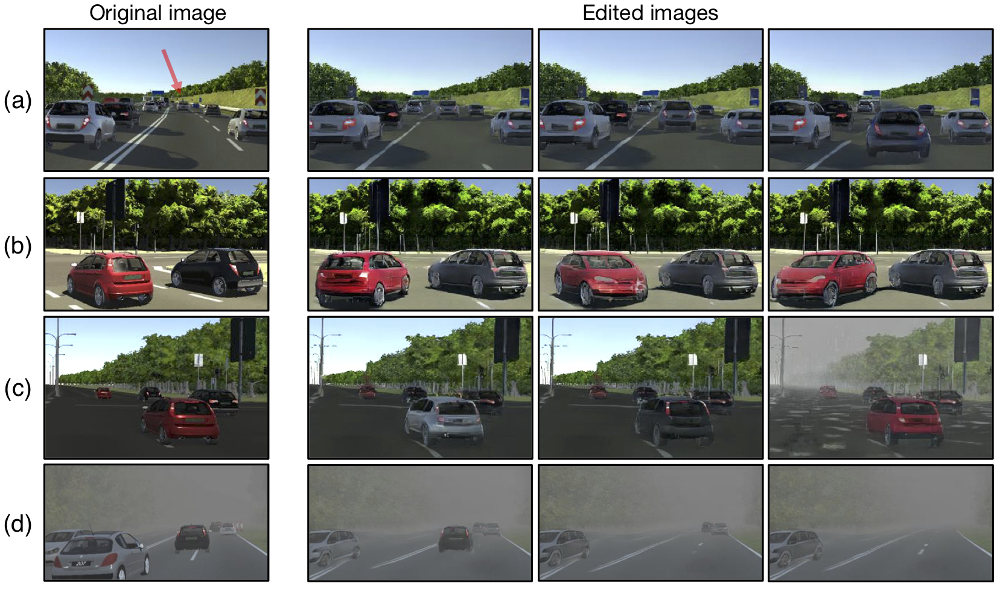
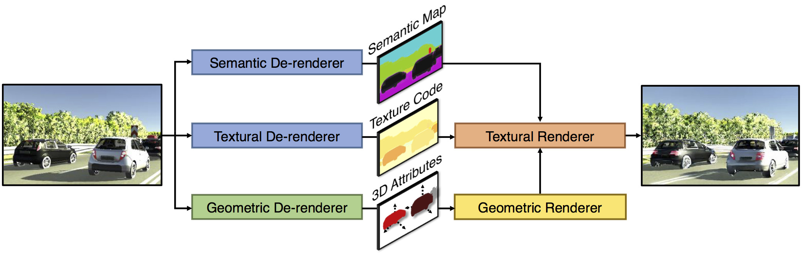
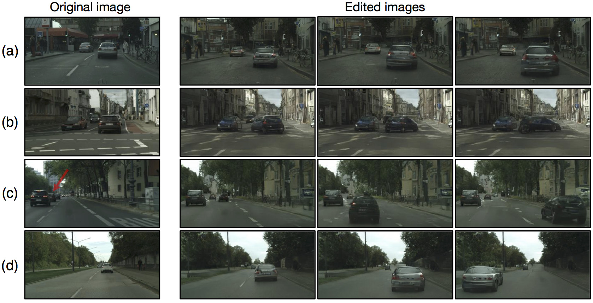
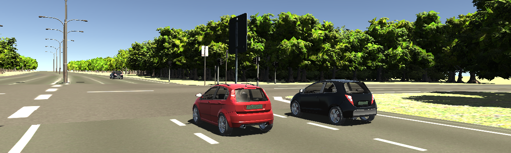
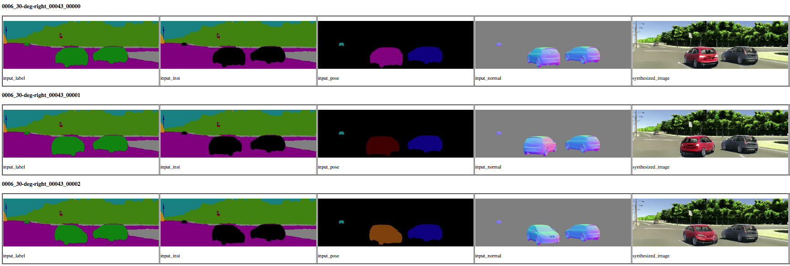

# 3D Scene De-rendering Networks (3D-SDN)

[Project][proj] | [Paper][paper] | [Poster][poster]

PyTorch implementation for 3D-aware scene de-rendering and editing. Our method integrates disentangled representations for semantics, geometry, and appearance into a deep generative model. The disentanglement of semantics, geometry, and appearance supports 3D-aware scene manipulation such as
(a) translation, (b) rotation, (c) color and texture editing, and
(d) object removal and occlusion recovery.




**3D-Aware Scene Manipulation via Inverse Graphics**  
[Shunyu Yao](http://people.csail.mit.edu/yaos)&ast;, [Tzu-Ming Harry Hsu](http://stmharry.github.io/)&ast;, [Jun-Yan Zhu](http://people.csail.mit.edu/junyanz/), [Jiajun Wu](https://jiajunwu.com/), [Antonio Torralba](http://web.mit.edu/torralba/www/), [William T. Freeman](https://billf.mit.edu/), [Joshua B. Tenenbaum](https://web.mit.edu/cocosci/josh.html)    
In Neural Information Processing Systems (*NeurIPS*) 2018.  
MIT CSAIL, Tsinghua University, and Google Research.

## Framework
Our de-renderer consists of a semantic-, a textural- and a geometric branch. The textural renderer and geometric renderer then learn to reconstruct the original image from the representations obtained by the de-renderer modules.



## Example Results on Cityscapes
Example user editing results on Cityscapes.
(a) We move two cars closer to the camera.<br>
(b) We rotate the car with different angles.<br>
(c) We recover a tiny and occluded car and move it closer. Our model can synthesize the occluded region. <br>
(d) We move a small car closer and then change its locations.



## Prerequisites

- Linux
- Python 3.6+
- PyTorch 0.4
- NVIDIA GPU (GPU memory > **8GB**) + CUDA 9.0


## Getting Started

### Installation

1. Clone this repository
    ```bash
    git clone https://github.com/ysymyth/3D-SDN.git && cd 3D-SDN
    ```

2. Download the pre-trained weights
    ```bash
    ./models/download_models.sh
    ```

3. Set up the conda environment
    ```bash
    conda env create -f environment.yml && conda activate 3dsdn
    ```

4. Compile dependencies in `geometric/maskrcnn`
    ```bash
    ./scripts/build.sh
    ```

5. Set up environment variables
    ```bash
    source ./scripts/env.sh
    ```

### Image Editing




We are using `./assets/0006_30-deg-right_00043.png` as the example image for editing.

#### Semantic Branch
```bash
python semantic/vkitti_test.py \
    --ckpt ./models \
    --id vkitti-semantic \
    --root_dataset ./assets \
    --test_img 0006_30-deg-right_00043.png \
    --result ./assets/example/semantic
```

#### Geometric Branch
```bash
python geometric/scripts/main.py \
    --do test \
    --dataset vkitti \
    --mode extend \
    --source maskrcnn \
    --ckpt_dir ./models/vkitti-geometric-derender3d \
    --maskrcnn_path ./models/vkitti-geometric-maskrcnn/mask_rcnn_vkitti_0100.pth \
    --edit_json ./assets/vkitti_edit_example.json \
    --input_file ./assets/0006_30-deg-right_00043.png \
    --output_dir ./assets/example/geometric
```


#### Textural Branch
```bash
python textural/edit_vkitti.py \
    --name vkitti-textural \
    --checkpoints_dir ./models \
    --edit_dir ./assets/example/geometric/vkitti/maskrcnn/0006/30-deg-right \
    --edit_source ./assets/0006_30-deg-right_00043.png \
    --edit_num 5 \
    --segm_precomputed_path ./assets/example/semantic/0006_30-deg-right_00043.png \
    --results_dir ./assets/example \
    --feat_pose True \
    --feat_normal True
```

Then the edit results can be viewed at `./assets/example/vkitti-textural_edit_edit_60/index.html`.

Simply do `cd ./assets/example/vkitti-textural_edit_edit_60 && python -m http.server 1234` and use your browser to connect to the server. You should see the results with intermediate 2.5D representations rendered as follows.




## Training/Testing
Please set up the datasets first and refer to `semantic/README.md`, `geometric/README.md`, and `textural/README.md` for training and testing details.

- Download the [Virtual KITTI dataset](http://www.europe.naverlabs.com/Research/Computer-Vision/Proxy-Virtual-Worlds).
```bash
./datasets/download_vkitti.sh
```
Please cite their paper if you use their data.

## Experiments

### Virtual KITTI Benchmark

Here is a fragment of our Virtual KITTI benchmark edit specification, in the form of a `json` file. For each edit pair, a source image would be `world/topic/source.png` and a target image would be `world/topic/target.png`. A list of `operations` is specified to transform the source image to the target image. Aligned with human cognition, each operation is either moving (`modify`) an object `from` a position `to` another, or `delete` it from our view. Additionally, we may enlarge (`zoom`) the object or rotate the object along the y-axis (`ry`). Note the y-axis points downwards, consistent with the axis specification of the Virtual KITTI dataset. The `u`'s and `v`'s denote the objects' 3D center projected onto the image plane. We indicate a target region of interest `roi` on top of the target `(u, v)` position. There are 92 such pairs in the benchmark.
```json
{
    "world": "0006",
    "topic": "fog",
    "source": "00055",
    "target": "00050",
    "operations": [
        {
            "type": "modify",
            "from": {"u": "750.9", "v": "213.9"},
            "to": {"u": "804.4", "v": "227.1", "roi": [194, 756, 269, 865]},
            "zoom": "1.338",
            "ry": "0.007"
        }
    ]
}
```

#### Semantic Branch
```bash
python semantic/vkitti_test.py \
    --ckpt ./models \
    --id vkitti-semantic \
    --root_dataset ./datasets/vkitti \
    --test_img benchmark \
    --benchmark_json ./assets/vkitti_edit_benchmark.json \
    --result ./assets/vkitti-benchmark/semantic
```
#### Geometric Branch
```bash
python geometric/scripts/main.py \
    --do test \
    --dataset vkitti \
    --mode extend \
    --source maskrcnn \
    --ckpt_dir ./models/vkitti-geometric-derender3d \
    --maskrcnn_path ./models/vkitti-geometric-maskrcnn/mask_rcnn_vkitti_0100.pth \
    --output_dir ./assets/vkitti-benchmark/geometric \
    --edit_json ./assets/vkitti_edit_benchmark.json
```
#### Textural Branch
```bash
python textural/edit_benchmark.py \
    --name vkitti-textural \
    --checkpoints_dir ./models \
    --dataroot ./datasets/vkitti \
    --edit_dir ./assets/vkitti-benchmark/geometric/vkitti/maskrcnn \
    --edit_list ./assets/vkitti_edit_benchmark.json \
    --experiment_name benchmark_3D \
    --segm_precomputed_path ./assets/vkitti-benchmark/semantic \
    --results_dir ./assets/vkitti-benchmark/ \
    --feat_pose True \
    --feat_normal True
```
Then the benchmark edit results can be viewed at `./assets/vkitti-benchmark/vkitti-textural_benchmark_3D_edit_60/index.html`.


## Reference
If you find this useful for your research, please cite the following paper.

```
@inproceedings{3dsdn2018,
  title={3D-Aware Scene Manipulation via Inverse Graphics},
  author={Yao, Shunyu and Hsu, Tzu Ming Harry and Zhu, Jun-Yan and Wu, Jiajun and Torralba, Antonio and Freeman, William T. and Tenenbaum, Joshua B.},
  booktitle={Advances in Neural Information Processing Systems},
  year={2018}
}
```

For any question, please contact [Shunyu Yao](yao-sy15@mails.tsinghua.edu.cn) and [Tzu-Ming Harry Hsu](stmharry@mit.edu).

## Acknowledgements
This work is supported by NSF #1231216, NSF #1524817, ONR MURI N00014-16-1-2007, Toyota Research Institute, and Facebook.

The semantic branch borrows from [Semantic Segmentation on MIT ADE20K dataset in PyTorch](https://github.com/CSAILVision/semantic-segmentation-pytorch), the geometric branch borrows from [pytorch-mask-rcnn](https://github.com/multimodallearning/pytorch-mask-rcnn) and [neural_renderer](https://github.com/hiroharu-kato/neural_renderer), and the textural branch borrows from [pix2pixHD](https://github.com/NVIDIA/pix2pixHD).

[proj]: http://3dsdn.csail.mit.edu/
[paper]: https://arxiv.org/pdf/1808.09351.pdf
[poster]: http://3dsdn.csail.mit.edu/3dsdn-poster.pdf
